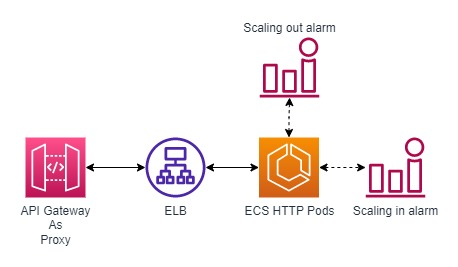

# API Gateway + Fargate Template Proof Of Concept

## Objective

This template aims to create a Fargate Cluster that is able answer to API calls passing this calls by API Gateway and scaling in the process when needed.

## Architecture Proposal

The architecture that we propose for this test follows:

## Deploy Stack
Docker and bash is required to run.

For a easy deployment of this stack you must have installed the Sam AWS application and AWS CLI installed and configured.

Its also needed to have the permissions to create, update and delete Cloudformation Stacks.

Before deploying, add your parameters in the params.json file. It is also necessary to add the account id in the createSam.js file.

With the Sam AWS installed run the following command: `yarn deploy`

## Outcome

After the deploy is done an Fargate Custer with Auto Scalling Tasks will be able to answer to HTTP calls. HTTP calls should be done to the API Gateway URL, the API Gateway will act as a proxy and forward this call to the ELB resource that will forward this call to the ECS Pod. In this structure we have the scaling alarms looking at the cluster CPU consumption to determine if its needed to add a new pod or kill an existing pod. The ELB resource will do its part as a load balancer and make constant health checks on the running pods.

You may use software as jmeter to make enough calls to cause the scaling alarm to go off. Its important to know that the alarms in this prof of concept is created by AWS and its not created explicitly in the cloudformation template present.

## Conclusion

Using this configuration you could set a ECS cluster to attend to API calls using API Gateway as a proxy, using API Gateway in this way you could mantain in the same set of APIs and URLs clusters and lambdas without any issue.