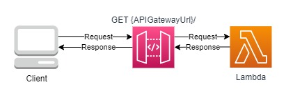

# API Gateway + Lambda Template Proof Of Concept

## Objective

This template aims to create an API Gateway that receives in some method a request, this request is forwarded to the lambda function so that it can compute the request and return a reponse for the API Gateway, the API Gateway, when the response is received, passes the lambda reponse for the client.

## Architecture Proposal

The architecture that we propose for this test follows:

## Deploy Stack

For a easy deployment of this stack you must have installed the Sam AWS application and AWS CLI installed and configured.

Its also needed to have the permissions to create, update and delete Cloudformation Stacks.

First run: `yarn` or `npm i` to install the required dependencies for the code.

Then compile the code with the command: `yarn build` or `tsc`

With the Sam AWS installed run the following command: `sam deploy --config-file samconfig.toml --capabilities CAPABILITY_NAMED_IAM`

If its your first time runing Sam you may want to use this command: `sam deploy -g --capabilities CAPABILITY_NAMED_IAM` for a more friendly approach.

## Outcome

After the deploy is done an API Gateway will be created, you will be able to make a GET call to this API, this call will receive the return `Hello World!!` from the lambda as a response. 

## Conclusion

Using this stack and configuration proposal you can setup with ease a API Gateway integrated with Lambda as the computing resource to process the request as needed, this is a classic serverless stack and enables the developers to setup APIs easily.