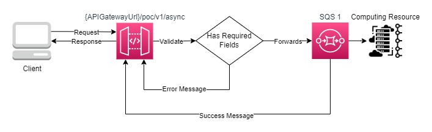

# API Gateway + SQS Template Proof Of Concept

## Objective

This template aims to create an API Gateway that receives in some method a request, this request must be validated by the API Gateway it self and its content must be forwarded to a SQS (also created by the template), if the response received from the SQS is 200 the message returned as a response from the API Gateway must be a custom one.

## Architecture Proposal

The architecture that we propose for this test follows:

## Deploy Stack

For a easy deployment of this stack you must have installed the Sam AWS application and AWS CLI installed and configured.

Its also needed to have the permissions to create, update and delete Cloudformation Stacks.

With the Sam AWS installed run the following command: `sam deploy --config-file samconfig.toml --capabilities CAPABILITY_NAMED_IAM`

If its your first time runing Sam you may want to use this command: `sam deploy -g --capabilities CAPABILITY_NAMED_IAM` for a more friendly approach.

## Outcome

After the deploy is done an API Gateway will be created, you will be able to make a post call to this API and if the request body is a **object** with the **keys** **message** and **dedupid** (and those keys being **strings**) your request will receive the success custom message setted in the template and the content of your request may be found in the SQS created in this template.

If your request body is not a object or dosent have one or more of the required keys your request will receive a error response for invalid body.

## Conclusion

Using this stack and configuration proposal you can setup with ease a API Gateway with high throughput, having as a limit the SQS and API Gateway throughputs.