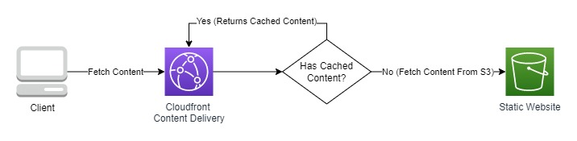

# Cloudfront + S3 Template Proof Of Concept

## Objective

This template aims to create a cloudfront distribution binded to a S3 bucket, the bucket will store the content and Cloudformation will consume the bucket content and cach it to serve without the need to access the bucket files each time a request for the page content is made.

## Architecture Proposal

The architecture that we propose for this test follows:

## Deploy Stack

For a easy deployment of this stack you must have installed the Sam AWS application and AWS CLI installed and configured.

Its also needed to have the permissions to create, update and delete Cloudformation Stacks.

With the Sam AWS installed run the following command: `sam deploy --config-file samconfig.toml`

If its your first time runing Sam you may want to use this command: `sam deploy -g` for a more friendly approach.

## Outcome

After the deploy is done all that is needed is to add content to the bucket and Cloudfront will cach it according to the policy stablish in the template. To add content to S3 on AWS CLI run: `aws s3 sync . s3://{bucket_name}/ --acl public-read`.

To access the Cloudfront distribution you can get the URL on the AWS Console or on the Cloudformation Stack Ouputs, where it is identified by CDNUrl.

## Conclusion

Using this stack and configuration proposal you can setup a content distribution for static websites using only Cloudfront and S3.