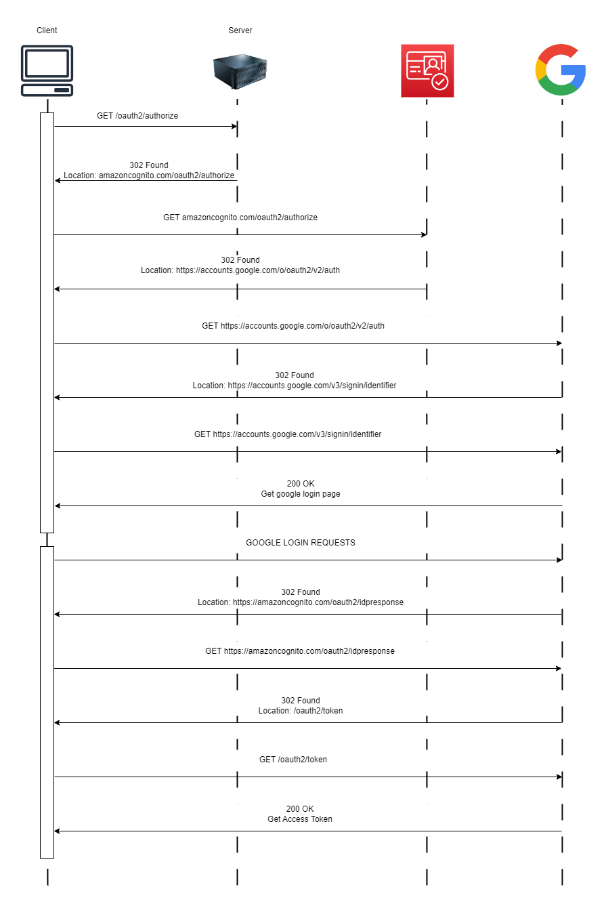

# Cognito+GoogleIdentityProvider

## Objectives

This proof of concept has the objetive to demonstrate the integration between AWS Cognito and the Google Identity provider, allowing users to authenticate with their Google credentials.

## Diagram



### Run

Deploy AWS Resources

```sh
aws cloudformation --profile {PROFILE} --region {REGION} deploy --no-fail-on-empty-changeset --template-file templates/cognito.yaml --stack-name {STACK_NAME} --capabilities CAPABILITY_NAMED_IAM --parameter-overrides CallbackUrl={CALLBACK_URL} GoogleClientId={GOOGLE_CLIENT_ID} GoogleClientSecret={GOOGLE_SECRET_ID} Name={NAME}
```

Env file:

```pug
REGION={REGION} // AWS Region
USER_POOL_ID={USER_POOL_ID} // Cognito User Pool ID (AWS::Cognito::UserPool)
CLIENT_ID={CLIENT_ID} // Cognito Client Id (AWS::Cognito::UserPoolClient)
SCOPE="aws.cognito.signin.user.admin"
PROVIDER="Google"
AUTH_DOMAIN={AUTH_DOMAIN} // Cognito auth domain (AWS::Cognito::UserPoolDomain)
REDIRECT_URL="http://localhost:3000/oauth2/token"
```

Run backend

```sh
yarn && yarn dev
```
