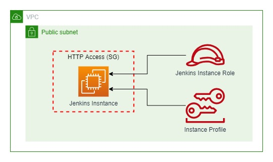

# EC2 + Jenkins Template Proof Of Concept

## Objective

This template aims to create a brand new EC2 with SSM and Jenkins installed.

## Architecture Proposal

The architecture that we propose for this test follows:

## Deploy Stack

For a easy deployment of this stack you must have installed the Sam AWS application and AWS CLI installed and configured.

Its also needed to have the permissions to create, update and delete Cloudformation Stacks.

With the Sam AWS installed run the following command: `sam deploy --config-file samconfig.toml`

If its your first time runing Sam you may want to use this command: `sam deploy -g` for a more friendly approach.

After the deploy is done, you may access the EC2 through SSM on AWS Console and run the following commands on terminal:

Enable Jenkins service on OS: `sudo systemctl enable jenkins`

Start Jenkins service on OS: `sudo systemctl start jenkins`

Get AdminPassword for inicial configuration: `sudo cat /var/lib/jenkins/secrets/initialAdminPassword`

After running those commands access the EC2 public DNS on port `8080` and use the **initialAdminPassword** to start the configuration.

## Outcome

After the deploy and a small configuration step you will have your EC2 setup for use and ready for any customization that you may want to.

## Conclusion

Using this template you will generate and EC2 almost ready for use with Jenkins, this will heplp you to setup your CI/CD process with much more easy