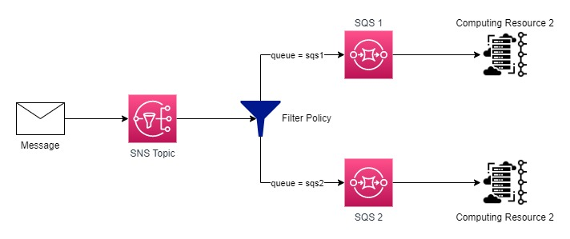

# SQS + SNS Template Proof Of Concept

## Objective

This template aims to create a SNS topic with two SQSs subscribed to it, the messages sended to this topic must be fowarded to the subscribers based on the **queue** attribute value informed in the message attributes of the published message.

## Architecture Proposal

The architecture that we propose for this test follows:

## Deploy Stack

For a easy deployment of this stack you must have installed the Sam AWS application and AWS CLI installed and configured.

Its also needed to have the permissions to create, update and delete Cloudformation Stacks.

With the Sam AWS installed run the following command: `sam deploy --config-file samconfig.toml`

If its your first time runing Sam you may want to use this command: `sam deploy -g` for a more friendly approach.

## Outcome

After the deploy is done in the SNS topic, accessible in your AWS console, any message that is published with the **queue** attribute and its value **squals** to **sqs1** will be forwarded only to SQS 1, if the message has the **queue** attribute but its value is **equals** to **sqs2** this message will be forwarded only to SQS 2.

If the message published has no **queue** attribute or its value is nor **sqs1** or **sqs2** the message will not be forwarded to any queues.

## Conclusion

Using this stack and configuration any application can set up event driven actions to a certain extent.