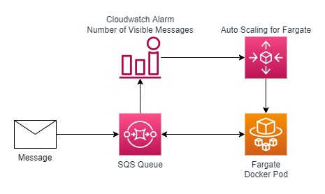

# SQS + Fargate Template Proof Of Concept

## Objective

This template aims to create a Fargate Cluster that is able to stay with zero tasks running until there is at least one message in the created queue to process.

## Architecture Proposal

The architecture that we propose for this test follows:

## Deploy Stack

For a easy deployment of this stack you must have installed the Sam AWS application and AWS CLI installed and configured.

Its also needed to have the permissions to create, update and delete Cloudformation Stacks.

With the Sam AWS installed run the following command: `sam deploy --config-file samconfig.toml --capabilities CAPABILITY_NAMED_IAM`

If its your first time runing Sam you may want to use this command: `sam deploy -g --capabilities CAPABILITY_NAMED_IAM` for a more friendly approach.

When the stack is fully created, or if it become stuck, run the following commands to build and push the docker image to the ECR repository created:

Login command: `aws ecr get-login-password --region us-east-2 | docker login --username AWS --password-stdin {account_number}.dkr.ecr.us-east-2.amazonaws.com`

Build image command: `docker build -t {ecr_name} .`

Tag image command: `docker tag ecr-poc-fargate:latest {account_number}.dkr.ecr.us-east-2.amazonaws.com/ecr-poc-fargate:latest`

Push image command: `docker push {account_number}.dkr.ecr.us-east-2.amazonaws.com/{ecr_name}:latest`

## Outcome

After the deploy is done an Fargate Custer with Auto Scalling Tasks will be able to consume messages available in the created SQS Queue. The number of pods will start at 0 and will stop at a maximum of 1, when the alarm is in the alarmed state (when the queue has more then 0 messages available) a new pod will be started, when the maximum number os pods is runing no more pods will be stared, and when the last message is processed the number of pods will once again become 0.

You may send a message in the created Queue and check the alarm in the Cloudwatch alarms and the processing in the Cloudwatch Logs.

## Conclusion

Using this stack and configuration proposal you can setup with ease a Fargate Cluster that will only run when there are messages to process, this scalling proposal minimizes costs and ensures that all the messages are processed using the scalling configured in the template.